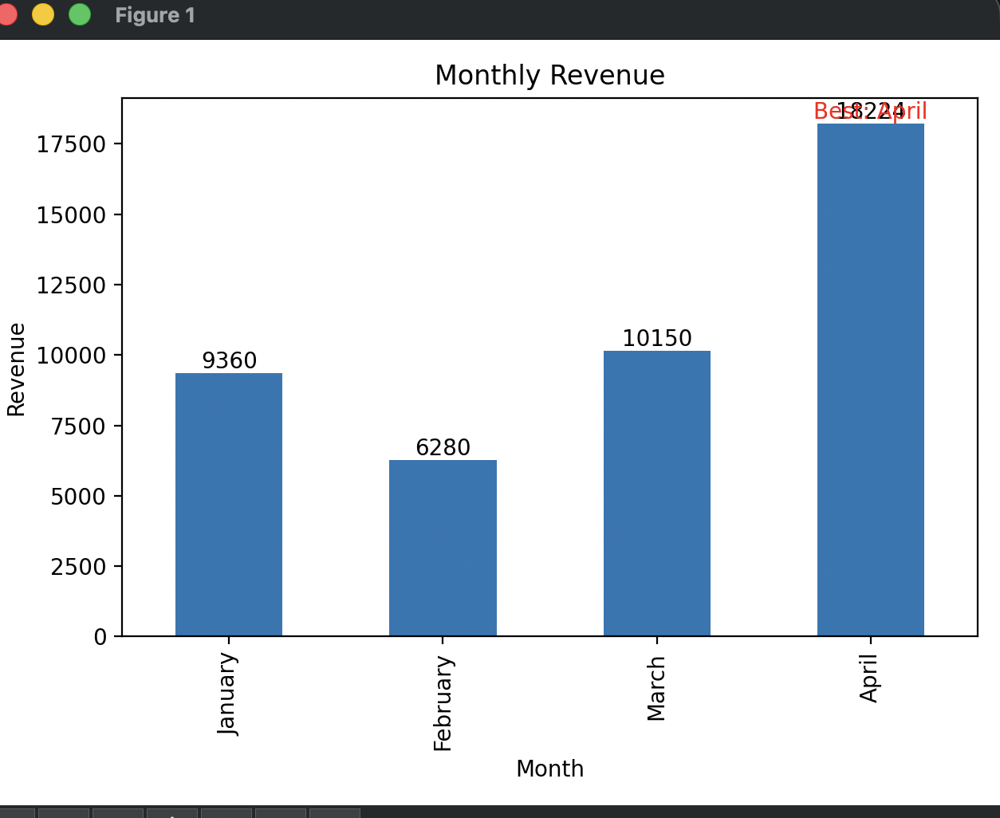
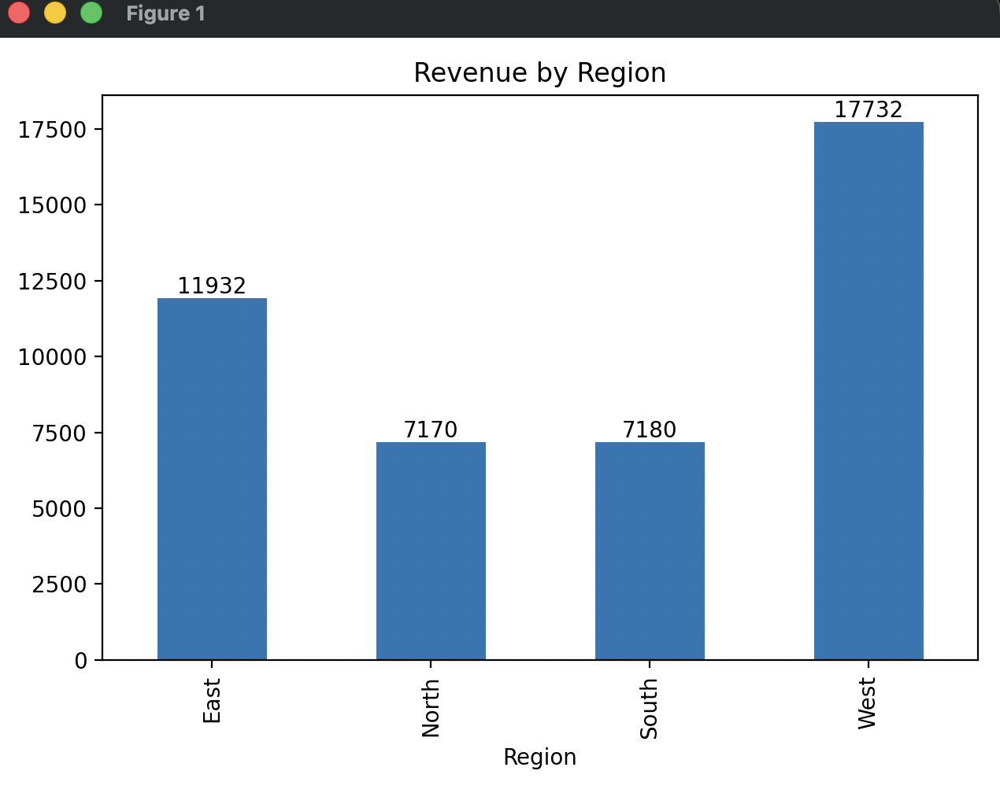
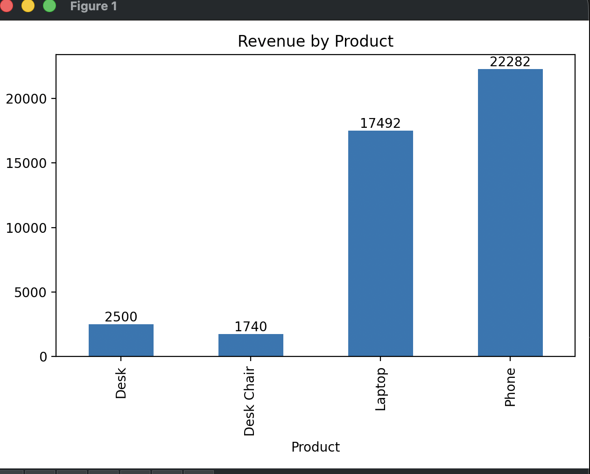

# Sales Data Analysis Dashboard

## Overview

This project analyzes a sales dataset to understand how revenue changes across time, regions, and products. The goal was to take raw sales data and turn it into clear insights that can support business decisions.

I initially built this as a simple analysis script and later improved it by adding structured insights, clearer visualizations, and practical recommendations.

---

## Problem

The dataset contains sales records, but it does not directly answer important business questions:

* When does the business perform best?
* Which regions generate the most revenue?
* Which products drive sales?
* Where is performance weak?

Without analysis, the data has limited value.

---

## Approach

### Data Preparation

* Converted date column to datetime
* Handled missing values in `Units_Sold` and `Price`
* Created a `Revenue` column:

  Revenue = Units_Sold × Price × (1 − Discount)

---

### Analysis

Used Pandas `groupby` to analyze:

* Monthly revenue trends
* Revenue by region
* Revenue by product

---

### Visualization

Created bar charts to clearly present:

* Monthly revenue (with labels and highlighted best month)
* Revenue by region
* Revenue by product

---

## Key Findings

* April generated the highest revenue at $18,224.69, contributing 41.41% of total revenue.
* The West region generated the highest revenue at $17,732.31, accounting for 40.29% of total revenue.
* Phone was the top-selling product, generating the highest overall revenue among all products.
* February showed the lowest performance, with revenue of $6,280.00.
---

## Recommendations

* Increase marketing efforts during April, as it contributes over 40% of total revenue.
* Investigate February’s low performance and adjust strategy to improve sales.
* Focus on promoting the Phone, as it is the highest revenue-generating product.
* Expand operations in the West region, which contributes over 40% of total revenue.

---

## Visualizations

### Monthly Revenue

### Revenue by Region

### Revenue by Product

---

## Tools Used

* Python
* Pandas
* Matplotlib

---

## How to Run

1. Install dependencies:
   pip install -r requirements.txt

2. Run the analysis script:
   python3 sales_dashboard.py

3. (Optional) Open the notebook:
   analysis.ipynb

---

## What I Improved

* Added multi-level analysis (month, region, product)
* Improved charts with labels and highlights
* Structured insights and recommendations
* Focused on explaining results clearly

---

## Limitations

* Uses static dataset
* No interactive dashboard

---

## Future Work

* Convert to interactive dashboard (Streamlit)
* Add filters (date, region, product)
* Explore forecasting

---

## Takeaway

This project demonstrates my ability to clean data, analyze trends, and communicate insights in a clear and structured way.

---

